# copy-gps

A Windows shell extension that adds a context menu item to copy the GPS location data from a JPG image to the clipboard
and shows a toast notification with handy links to the location in Google Maps and Gaia GPS.

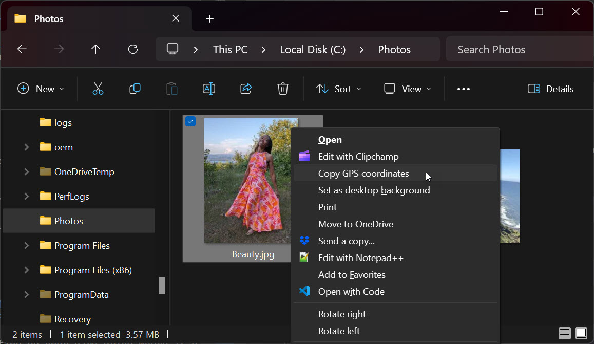

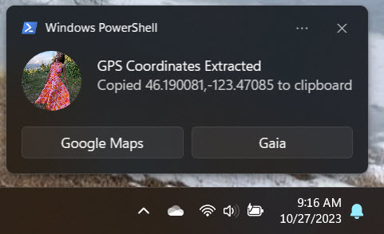

## Why It's Useful

Although the file properties dialog will display the GPS coordinates of an image in File Manager, there is no way to copy
it to the clipboard, making it painful to try to view the location in a service like Google Maps or Gaia GPS. I needed
a way to quickly extract the location from a photo and view its location on a map.

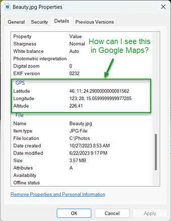

## How It Works

The main piece is a short PowerShell script that extracts the GPS location data from a .jpg or .jpeg image, copies it to the
clipboard, and shows a Windows Toast Notification in the lower right corner. The script is triggered by a right-click
menu option that appears in File Explorer. This menu option is added by configuring a shell extension in the
SystemFileAssociations registry.

## Requirements

- Windows. I'm not sure what the oldest version this runs on. I'm running it on Windows 11.
- [BurntToast](https://github.com/Windos/BurntToast/) - PowerShell Module for displaying Windows Toast Notifications.
  See below for installation instructions.

## Installation

There are three main steps. Detailed instructions below.

1. Install [BurntToast](https://github.com/Windos/BurntToast/) if not already installed.
1. Copy `copy-gps.ps1` somewhere on your Windows PC.
1. Add the registry settings that create the right-click menu option for .jpg/.jpeg files in File Explorer.

### Install BurntToast

1. Open a PowerShell Window with administrative permission.

   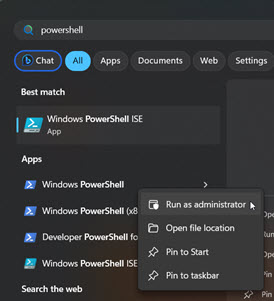

1. Type `Install-Module -Name BurntToast` and follow the prompts to complete the installation.

   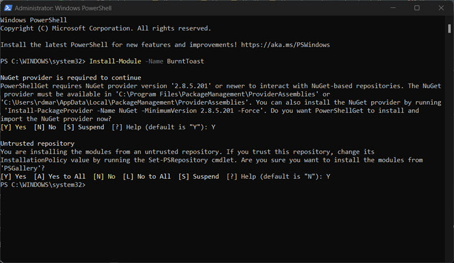

### Install copy-gps.ps1

- Copy `copy-gps.ps1` from this repository to somewhere on your PC. Or just clone it.

### Add shell extension (option 1)
The repository contains a file that will automatically add the context menu command for .jpg and .jpeg files. If you prefer
to update the registry manually, use option 2.

1. Open `register-copygps-for-jpg-and-jpeg.reg` in a text editor and update the path to `copy-gps.ps1` to the location
   you copied to.

   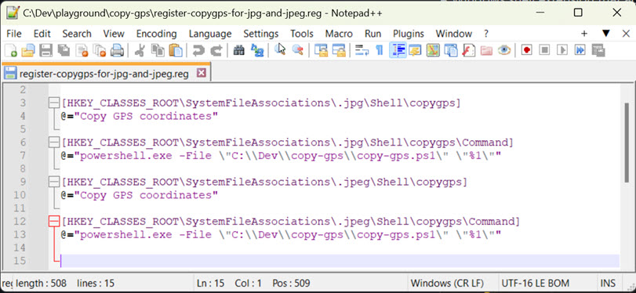

1. Execute the file by double-clicking it in File Explorer.

### Add shell extension (option 2)

Follow these steps to manually add the keys.

1. Use `regedit.exe` to navigate to `HKEY_CLASSES_ROOT\SystemFileAssociations\.jpg\Shell`.
1. Add a new key named `copy-gps` with the value "Copy GPS coordinates". This is the text that will appear in the 
   right-click menu.
1. Add a child key beneath `copy-gps` named `Command`. Set the value to 
   `powershell.exe -File "C:\Dev\copy-gps\copy-gps.ps1" "%1"`, updating the path as needed.
1. Repeat the above steps for the .jpeg file extension.

   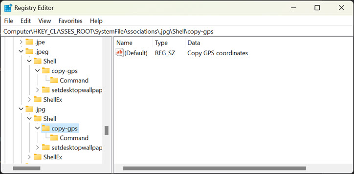
   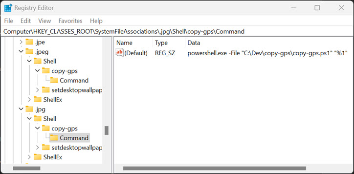

## Using it

- In File Manager, hold the shift key and right-click a .jpg or .jpeg image and click Copy GPS coordinates.

   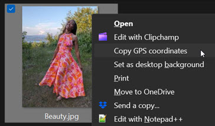

  > 💡 TIP: Alternatively, you can right-click, then choose Show More Options.

   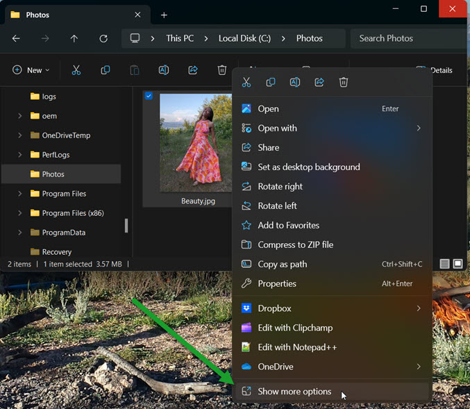

- A PowerShell window will briefly appear and close, following by a Windows Toast Notification.

  

- If the image does not contain GPS data, this message will appear:

  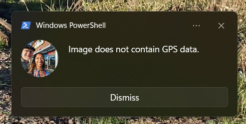


## Notes

- You may need to restart File Explorer for the registry changes to take effect.
- Remember to hold the shift key when you right-click to see the menu option.
- The notification includes buttons that open Google Maps and Gaia GPS in the default browser. Edit the PowerShell
  script if you wish to modify this behavior.
- If the browser is currently hidden, clicking one of the buttons does not bring it to the foreground, so you may have to 
  manually switch to the browser window. This is default PowerShell behavior. There are hacks for dealing with it, but
  I didn't go down that road.
- One can avoid the BurntToast dependency by creating the toast manually, but achieving the same functionality 
  (thumbnail image and action buttons) is more difficult. For example, to create a plain text notification, this code
  can be used as a starter. Credit to [Den Delimarsky](https://den.dev/blog/powershell-windows-notification/).

```powershell
  function Show-Notification {
    [cmdletbinding()]
    Param (
        [string]
        $ToastTitle,
        [string]
        [parameter(ValueFromPipeline)]
        $ToastText
    )

    [Windows.UI.Notifications.ToastNotificationManager, Windows.UI.Notifications, ContentType = WindowsRuntime] > $null
    $Template = [Windows.UI.Notifications.ToastNotificationManager]::GetTemplateContent([Windows.UI.Notifications.ToastTemplateType]::ToastText02)

    $RawXml = [xml] $Template.GetXml()
    ($RawXml.toast.visual.binding.text|where {$_.id -eq "1"}).AppendChild($RawXml.CreateTextNode($ToastTitle)) > $null
    ($RawXml.toast.visual.binding.text|where {$_.id -eq "2"}).AppendChild($RawXml.CreateTextNode($ToastText)) > $null

    $SerializedXml = New-Object Windows.Data.Xml.Dom.XmlDocument
    $SerializedXml.LoadXml($RawXml.OuterXml)

    $Toast = [Windows.UI.Notifications.ToastNotification]::new($SerializedXml)
    $Toast.Tag = "PowerShell"
    $Toast.Group = "PowerShell"
    $Toast.ExpirationTime = [DateTimeOffset]::Now.AddMinutes(1)

    $Notifier = [Windows.UI.Notifications.ToastNotificationManager]::CreateToastNotifier("PowerShell")
    $Notifier.Show($Toast);
}
```